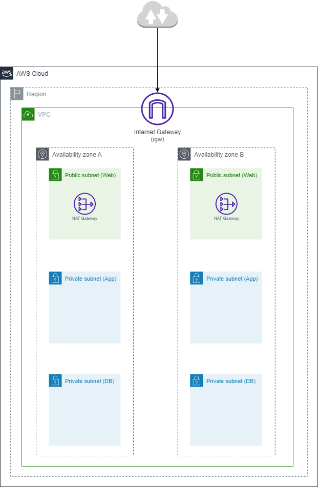

# AWS CloudFormation Template: Highly Available VPC for Three-Tier Architecture

This CloudFormation template deploys a highly available Virtual Private Cloud (VPC) for a three-tier architecture in AWS.

For more detailed instructions and insights on this CloudFormation template, refer to the accompanying Medium article: [Link to Medium Article](https://medium.com/@alaa00nasser/deploying-a-vpc-for-a-three-tier-architecture-using-cloudformation-9a409427629f)

## Architecture Overview

The CloudFormation template provisions the following resources:

- VPC: Creates a highly available VPC with the specified IP range.
- Subnets: Sets up public and private subnets in two availability zones (AZ-A and AZ-B).
- Internet Gateway: Attaches an internet gateway to the VPC for internet access.
- NAT Gateways: Deploys NAT gateways in each availability zone for outbound internet traffic from private subnets.
- Route Tables: Configures route tables to direct traffic between subnets and NAT gateways.

## Prerequisites

Before deploying this CloudFormation template, ensure you have the following prerequisites in place:

- AWS Account: You must have an AWS account to deploy the CloudFormation template.
- AWS CLI or AWS Management Console: You can use the AWS CLI or AWS Management Console to deploy the CloudFormation stack.

## Deployment Steps

To deploy this CloudFormation template, follow these steps:

1. Clone or download the repository containing the CloudFormation template.
2. Modify the template parameters if needed by editing the `template.yaml` file.
3. Deploy the CloudFormation stack using one of the following methods:
   - AWS CLI: Run the command `aws cloudformation create-stack` or `aws cloudformation deploy` with appropriate parameters.
   - AWS Management Console: Upload the template to the CloudFormation service and follow the guided deployment process.
4. Monitor the stack creation progress in the AWS Management Console or using the AWS CLI.
5. After the stack is created successfully, you can access the outputs section to get information about the deployed resources, such as VPC ID, NAT gateways, and subnets.

## Parameters

This CloudFormation template accepts the following parameters:

- **EnvironmentName**: The name of the environment (e.g., "dev", "test", "prod").
- **VPCCIDR**: The IP range for the VPC in CIDR notation.
- **WebSubnetACIDR**: The IP range for the public web subnet in Availability Zone A.
- **AppSubnetACIDR**: The IP range for the private app subnet in Availability Zone A.
- **DBSubnetACIDR**: The IP range for the private DB subnet in Availability Zone A.
- **WebSubnetBCIDR**: The IP range for the public web subnet in Availability Zone B.
- **AppSubnetBCIDR**: The IP range for the private app subnet in Availability Zone B.
- **DBSubnetBCIDR**: The IP range for the private DB subnet in Availability Zone B.

## Cleanup

To delete the CloudFormation stack and associated resources:

1. Open the AWS Management Console or use the AWS CLI.
2. Navigate to the CloudFormation service.
3. Select the stack that you created.
4. Choose "Delete" or use the AWS CLI command `aws cloudformation delete-stack` to initiate the stack deletion process.
